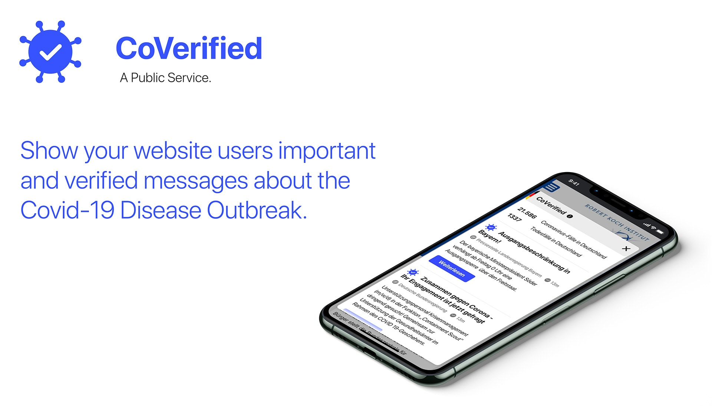

# [CoVerified](https://www.coverified.info/) Wordpress Plugin

*[CoVerified](https://www.coverified.info/) is a tool to show your websites users important and verified information about the COVID-19 outbreak*

## Contribute to fight the virus

TODO

## Code of Conduct

We'd like you to follow our [Code of Conduct](.github/CODE_OF_CONDUCT.md)

---

This project was [initially started](https://devpost.com/software/1_039_c_staatlichekommunikation_webinfowidget) during the [#wirvsvirus hackathon](https://twitter.com/hashtag/WirVsVirusHack)
